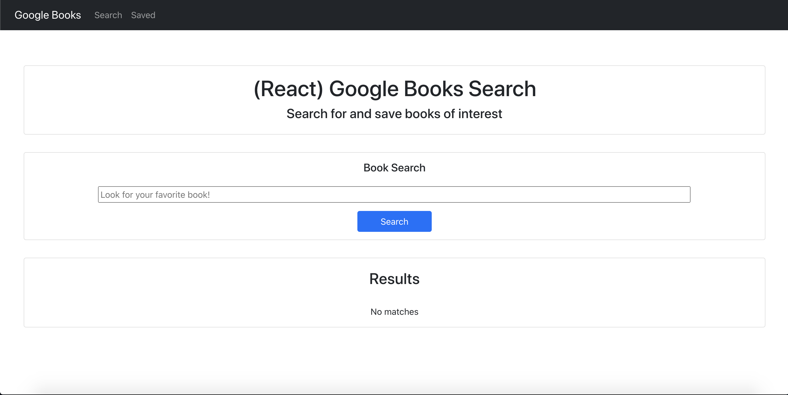
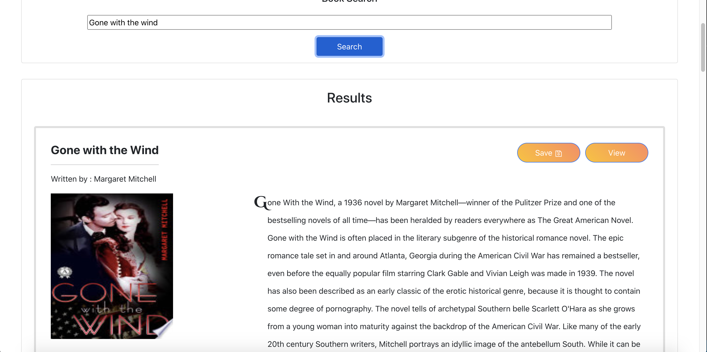
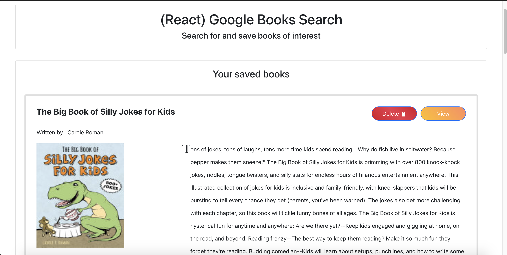

 # Google-Books-Search 

   
  This application allows user to search books using a Google Books API and save them into their favorites. Users can save and delete books from their favorites list. 
   

   [Deployed last version](https://guarded-castle-60005.herokuapp.com/)
   [Github repo](https://github.com/Amal31497/Google-Books-Search)

   

  ## Table of Contents 
 
  ##### * [Technologies used](#Technologies)
  ##### * [Usage walkthrough](#Walkthrough)
  ##### * [Credits](#Credits)
  ##### * [Contributing](#Contributing)
  ##### * [License](#License)
  ##### * [Contact Info](#Contact)

  ## Technologies:
   _*HTML, CSS, Javascript, Node.js, Bootstrap, Heroku App, Goole APIs, React.js, React Hooks, Express.js, MongoDB*_

  ## Walkthrough:

  #### Screenshots:
  
  
  
  
  ## Contributing:
   To contribute to this repo:

   - Fork the repo
   - Make changes to forked repo
   - Submit a pull request to this repo
  
  ## Credits:
  [w3schools.com](w3schools.com)
  [MDN](MDN)
  [https://reactjs.org/](https://reactjs.org/)

  ## License: 

  ##### Copyright: Amal Janabayev

  ##### 

  ##### [License Link](https://www.gnu.org/licenses/gpl-3.0.en.html)

  ## Contact: 

  ##### amalj2426@gmail.com
